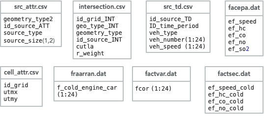
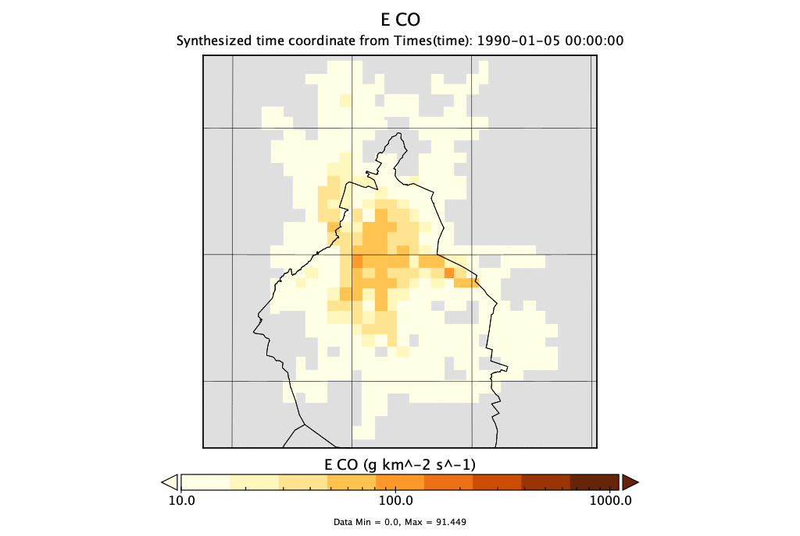
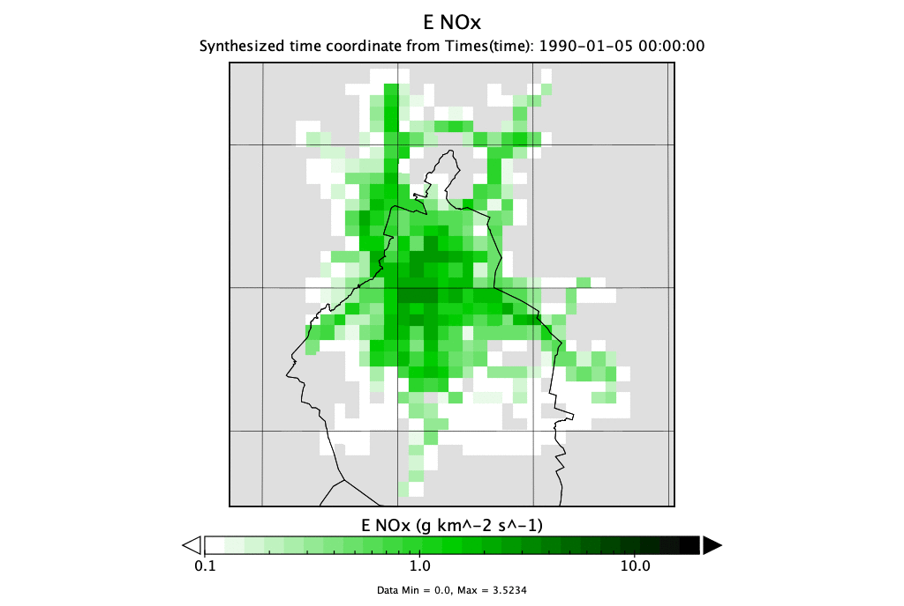

# mobile\_time — Gridded Temporal Profiles for Mobile Emissions over Mexico City

[](https://github.com/JoseAgustin/mobile_time)
[]()
[]()
[]()
[]()
[](https://github.com/JoseAgustin/mobile_time/releases/tag/v1.1)

> A Fortran 90 program that computes **gridded hourly temporal profiles and daily emissions** for mobile sources (VOC, CO, NO, and SO₂) over the Mexico City metropolitan area, using vehicular activity data from **11,848 street segments**, 8 vehicle types, EPA emission factors, and cold-start corrections. Outputs are produced in NetCDF, GrADS binary, and CSV formats for direct use in air quality models such as WRF-Chem.

---

## Table of Contents

- [Scientific Background](#scientific-background)
- [Requirements](#requirements)
- [Repository Structure](#repository-structure)
- [Input Data](#input-data)
  - [src\_attr.csv — Source attributes](#src_attrcsv--source-attributes)
  - [cell\_attr.csv — Grid cell attributes](#cell_attrcsv--grid-cell-attributes)
  - [src\_td.csv — Vehicular activity by segment and hour](#src_tdcsv--vehicular-activity-by-segment-and-hour)
  - [intersection.csv — Segment-to-grid intersection weights](#intersectioncsv--segment-to-grid-intersection-weights)
  - [factepa.txt — EPA emission factors](#factepatxt--epa-emission-factors)
  - [factsec.txt — Cold-start emission factors](#factsectxt--cold-start-emission-factors)
  - [factvar.dat — Engine-mode correction factors](#factvardt--engine-mode-correction-factors)
  - [fraarran.dat — Cold-start fraction by hour](#fraarrandt--cold-start-fraction-by-hour)
- [Coding Tables](#coding-tables)
  - [Time periods](#time-periods)
  - [Vehicle types](#vehicle-types)
  - [Emission factor categories](#emission-factor-categories)
  - [Road / source type classification (kstype)](#road--source-type-classification-kstype)
- [Program Logic](#program-logic)
- [Source Code Overview](#source-code-overview)
- [Build and Installation](#build-and-installation)
- [Usage](#usage)
- [Output Files](#output-files)
  - [NetCDF — emission\_YYYY-MM-DD\_HH.nc](#netcdf--emission_yyyy-mm-dd_hhnc)
  - [GrADS binary — movil.dat and movil\_day.dat](#grads-binary--mobildat-and-mobil_daydat)
  - [CSV — TP\_\*.csv and traffic.csv](#csv--tp_csv-and-trafficcsv)
- [Domain and Projection](#domain-and-projection)
- [Results](#results)
- [References](#references)

---

## Scientific Background

Accurate temporal profiles are essential for air quality modelling: models like WRF-Chem require emission rates at each grid cell and each hour of the day, whereas emission inventories are typically reported as annual or daily totals. For mobile (on-road traffic) sources, the diurnal pattern of emissions depends on traffic volume, vehicle speed, fleet composition, and engine operating mode at each individual road segment.

`mobile_time` computes these profiles from the bottom up. For each of the 11,848 georeferenced street segments in the Mexico City metropolitan area, the program:

1. Determines how much of each segment falls within each 2 km × 2 km model grid cell (spatial disaggregation via pre-computed intersection weights).
2. Applies EPA speed-dependent emission factors for 8 vehicle categories to the hourly traffic count and speed on that segment.
3. Adds a cold-start correction for gasoline passenger cars using an hourly cold-start fraction and a correction factor that varies by road type.
4. Aggregates the per-segment, per-hour emissions into each grid cell.
5. Derives the **temporal profile** as the ratio of the hourly emission to the daily total for each cell, species, day type, and vehicle type.

The result is a gridded dataset of temporal profiles (dimensionless, summing to 1 over 24 h) and gridded daily emission fluxes (g km⁻² s⁻¹) for three day types (weekday, Saturday, Sunday) and five pollutant groups (VOC gasoline, CO, NOₓ, VOC diesel, SO₂), representing Mexico City mobile emissions for the year 1990.

---

## Requirements

| Component | Notes |
|---|---|
| Fortran compiler | `gfortran` ≥ 6 or Intel `ifort` ≥ 17; free-form Fortran 90 |
| NetCDF-Fortran | `libnetcdff`; version 4.x; `netcdf.mod` required at compile time |
| GNU Autotools | `autoconf` ≥ 2.69, `automake` ≥ 1.11 |
| `nf-config` or `nc-config` | Used by `configure` to locate NetCDF automatically |
| Input data files | Must be placed in the `data/` subdirectory before running |

---

## Repository Structure

```
mobile_time/
├── mobile_time_grid.F90        # Main program — calls all subroutines in sequence
├── mod_mobile_time_grid.F90    # Module — all variables, subroutines, and functions
├── configure.ac                # Autoconf input — detects Fortran compiler and NetCDF
├── Makefile.am                 # Automake input — build rules
├── Makefile.in                 # Generated Makefile template
├── aclocal.m4                  # M4 macro definitions
├── autogen.sh                  # Convenience script: runs autoreconf
├── configure                   # Generated configure script (run to build)
├── autoconf/                   # Autoconf auxiliary files
├── data/                       # Input CSV/TXT/DAT files and output directory
├── testsuite/                  # Autotest test suite
├── assets/images/
│   ├── diagrama.jpg            # Input data diagram
│   ├── COemis.gif              # CO gridded emission result
│   └── NOxemis.gif             # NOx gridded emission result
├── Doc/                        # Additional documentation
└── README.md                   # This file
```

---

## Input Data

All input files must be placed in the `data/` subdirectory before running the program.

### src\_attr.csv — Source attributes

Attributes of each emission source (road segment or area source). One row per source; `natt` = 5,554 records.

| Column | Variable | Description |
|---|---|---|
| 1 | *(id)* | Record number |
| 2 | `geometry_type2` | Geometry: `1` = line source, `2` = area source |
| 3 | `id_source_ATT` | Unique source identifier |
| 4–7 | *(skipped)* | Additional identification fields |
| 8 | `source_type` | Road/area classification code (`kstype`; see table below) |
| 9 | `source_size(:,1)` | Source length (km) for line sources |
| 10 | *(skipped)* | |
| 11 | `source_size(:,2)` | Source area (km²) for area sources |

### cell\_attr.csv — Grid cell attributes

Attributes of each grid cell. One row per cell; `nic` = 952 cells (28 × 34).

| Column | Variable | Description |
|---|---|---|
| 1 | *(id)* | Record number |
| 2 | `id_grid` | Grid cell identifier |
| 3 | `utmx` | UTM easting (km), zone 14N |
| 4 | `utmy` | UTM northing (km), zone 14N |

UTM coordinates are converted to geographic lat/lon internally via the `utm_2_ll` subroutine (adapted from EPA SCRAM).

### src\_td.csv — Vehicular activity by segment and hour

Hourly traffic data per source segment, day type, and vehicle category. Total rows: `ntd` = 75,889.

| Columns | Variable | Description |
|---|---|---|
| 1–3 | *(skipped)* | |
| 4 | `id_source_TD` | Source segment identifier |
| 5 | `ID_time_period` | Day type code (1 = weekday, 2 = Saturday, 3 = Sunday) |
| 6 | `veh_type` | Vehicle type code (11–18; see table below) |
| 7–8 | *(skipped)* | |
| 9–32 | `veh_number(1:24)` | Number of vehicles per hour (hours 1–24) |
| 33–56 | `veh_speed(1:24)` | Mean speed per hour (km h⁻¹, hours 1–24) |

### intersection.csv — Segment-to-grid intersection weights

Spatial intersection between each road segment and the model grid. Total rows: `nint` = 11,848.

| Column | Variable | Description |
|---|---|---|
| 1 | *(id)* | Record number |
| 2 | `id_grid_INT` | Grid cell ID |
| 3 | `geo_type_INT` | Intersection geometry result type |
| 4 | `geometry_type` | Source geometry in this intersection |
| 5 | `id_source_INT` | Source segment ID |
| 6 | `cutla` | Cut length (km) or cut area (km²) of the segment in this cell |
| 7 | `r_weight` | Relative weight = cut length / total source length |

### factepa.txt — EPA emission factors

Speed-dependent emission factors for 5 vehicle categories (`nef` = 5) across 7 speed bins (`nfe` = 7). Species: VOC, CO, NO, SO₂. Units: g vehicle⁻¹ km⁻¹. One block per category with a 3-line header, followed by 7 rows of speed-vs-EF data.

### factsec.txt — Cold-start emission factors

Same format as `factepa.txt` but for cold-engine start conditions. Species: VOC, CO, NO. Applied to the fraction of gasoline cars with cold engines at each hour (`f_cold_engine_car`).

### factvar.dat — Engine-mode correction factors

24 hourly correction factors (`fcor`) scaling emissions for engine operating mode. One value per hour, preceded by a 1-line header.

### fraarran.dat — Cold-start fraction by hour

24 hourly fractions (`f_cold_engine_car`) representing the proportion of gasoline cars starting cold at each hour. One value per hour, preceded by a 1-line header.

---

## Coding Tables

### Time periods

| `ID_time_period` | Period |
|---|---|
| 1 | Working day (Monday–Friday) |
| 2 | Saturday |
| 3 | Sunday |
| 11 | Week average |
| 12 | Annual average |

### Vehicle types

| `veh_type` | SCC | Description | `veh_type` | SCC | Description |
|---|---|---|---|---|---|
| 11 | 2201001330 | Automóviles | 15 | 2230075330 | Otros buses |
| 12 | 2201040330 | Ligeros (light trucks) | 16 | 2230060330 | Medianos |
| 13 | 2230070270 | Microbuses | 17 | 2230074330 | Pesados (heavy trucks) |
| 14 | 2230001000 | Ruta 100 (public bus) | 18 | 2230001000 | Camiones Municipales |

### Emission factor categories

The 8 vehicle types are mapped to 5 EPA emission factor categories (`icar`) for the emission factor look-up:

| `veh_type` | `icar` | EPA category |
|---|---|---|
| 11 (Automóviles) | 1 | Vehículos ligeros a gasolina |
| 12 (Ligeros) | 2 | Camionetas ligeras a gasolina |
| 13 (Microbuses) | 5 | Camiones pesados a gasolina |
| 14 (Ruta 100) | 3 | Camiones ligeros a diésel |
| 15 (Otros buses) | 3 | Camiones ligeros a diésel |
| 16 (Medianos) | 3 | Camiones ligeros a diésel |
| 17 (Pesados) | 4 | Vehículos pesados a diésel |
| 18 (Camiones municipales) | 3 | Camiones ligeros a diésel |

VOC emissions are split: `emiss_factor(1)` (VOC gasoline) applies to types 11–13; `emiss_factor(4)` (VOC diesel) applies to types 14–18.

### Road / source type classification (kstype)

| `kstype` | Description | `kstype` | Description |
|---|---|---|---|
| 1 | Lateral (local road) | 16 | Estación pesados |
| 5 | Calle primaria | 17 | Estación de autobuses |
| 6 | Calle rápida (highway) | 21 | Área residencial municipal |
| 11 | Área residencial | 22 | Área res. e ind. municipal |
| 12 | Área res. e industrial | 23 | Área pueblo municipal |
| 13 | Área res. cerca de centro | 24 | Estación de automóviles |
| 14 | Área res. centro | 25 | Área industrial municipal |
| 15 | Área pueblo | | |

Road types (`kstype` < 10: values 1, 5, 6) apply the full cold-start correction. Area types (`kstype` ≥ 10) set the correction factor to 1.0. Area sources also have their effective length scaled by 10 %, and area-type intersection sources contribute 7.5 % of their calculated emission (`geo_type_INT = 2`).

---

## Program Logic

The main program `grid_mobil_temp` executes subroutines in the following sequence:

```
grid_mobil_temp
├── lee_atributos       — Read src_attr.csv and cell_attr.csv; convert UTM → lat/lon
├── lee_actividades     — Read src_td.csv (traffic) and intersection.csv (spatial weights)
├── lee_factor_emision  — Read factepa.txt, factsec.txt, factvar.dat, fraarran.dat
├── calcula_emision     — Compute hourly gridded emissions and temporal profiles
├── guarda_malla        — Write GrADS binary and CSV files
└── guarda_malla_nc     — Write NetCDF files (one per day type)
```

### Emission computation (`calcula_emision`)

For each of `ntd` = 75,889 traffic records and each of `nint` = 11,848 intersection records:

1. Match the source ID in the traffic file to the corresponding intersection record.
2. For each hour (1–24):
   - Retrieve effective segment length `sl`, cold-start fraction `ffr`, and correction factor `fcorr` via `viality()`.
   - Apply intersection weight: `sl = sl × r_weight`.
   - Interpolate the EPA emission factor at the actual vehicle speed using `emisfac2()` (linear interpolation between speed bins).
   - Compute hourly emission for each species:

     ```
     emission [g s⁻¹] = (N × sl × EF_hot × (1 − ffr) + N × sl × EF_cold × ffr) × fcorr / 3600
     ```

     where `N` = number of vehicles, `EF_hot` and `EF_cold` are in g vehicle⁻¹ km⁻¹.
   - Accumulate into `emision(cell, hour, species, day_type)` and `eday(cell, species, day_type)`.

3. **Temporal profile** for each cell, species, and day type:

   ```
   TP(cell, hour, species, day) = emision(cell, hour, species, day) / eday(cell, species, day)
   ```

   This dimensionless ratio (0–1, summing to 1 over 24 hours) is the quantity used by air quality pre-processors to distribute daily totals across hours.

---

## Source Code Overview

| File | Role |
|---|---|
| `mobile_time_grid.F90` | Main program; 33 lines; calls all subroutines |
| `mod_mobile_time_grid.F90` | Fortran module `grid_temp_mobile`; 1,003 lines; all data and logic |

### Subroutines and functions

| Name | Type | Description |
|---|---|---|
| `utm_2_ll` | Subroutine | Converts UTM zone-14N (km) to geographic lat/lon (°); adapted from EPA SCRAM |
| `lee_atributos` | Subroutine | Reads `src_attr.csv` and `cell_attr.csv` |
| `lee_actividades` | Subroutine | Reads `src_td.csv` and `intersection.csv` |
| `lee_factor_emision` | Subroutine | Reads `factepa.txt`, `factsec.txt`, `factvar.dat`, `fraarran.dat` |
| `calcula_emision` | Subroutine | Main emission loop over all traffic records and intersections |
| `viality` | Subroutine | Returns effective segment length `sl`, cold-start fraction `ffr`, and correction factor `fcorr` for a given source and hour |
| `emisfac2` | Function | Linearly interpolates the EPA EF table at a given speed for a given vehicle type |
| `guarda_malla` | Subroutine | Writes GrADS binary files and temporal profile CSV files |
| `guarda_malla_nc` | Subroutine | Writes three CF-compliant NetCDF files with full ACDD global attributes |
| `crea_attr` | Subroutine | Helper: defines a NetCDF variable and assigns CF standard attributes |
| `check` | Subroutine | NetCDF error handler (Unidata); stops on any non-zero status |
| `cuenta` | Function | Counts rows in an open file by reading to EOF; rewinds before returning |
| `mes` | Function | Returns 3-character month abbreviation for a 2-digit month number |
| `logs` | Subroutine | Prints a timestamped progress message to standard output |

---

## Build and Installation

The build system uses **GNU Autotools**. The `configure` script auto-detects the Fortran compiler and NetCDF-Fortran library.

### Step 1 — Generate the build system (first-time only)

If the `configure` script is absent (fresh clone without generated files):

```bash
bash autogen.sh
```

This runs `autoreconf -fvi` to produce `configure`, `Makefile.in`, and related files.

### Step 2 — Configure

```bash
./configure
```

`configure` searches for `nf-config` or `nc-config` on `PATH` to locate NetCDF automatically. For a non-standard NetCDF installation:

```bash
# Option A — specify the NetCDF root directory
./configure NETCDF_ROOT=/opt/netcdf4

# Option B — specify include and library flags separately
./configure NETCDF_INC=/opt/netcdf4/include \
            NETCDF_LIB="-L/opt/netcdf4/lib -lnetcdff -lnetcdf"
```

At the end of `configure`, a build summary is printed:

```
---------------------------------------------------------
Configuration complete - mobil_time_grid-1.0
Fortran compiler:          FC=gfortran
Fortran flags:             FCFLAGS=-g -O2
Root directory of netcdf:  NETCDF=/usr
Compiler flags for netcdf: NC_INC=-I/usr/include
Linker flags for netcdf:   NC_LIB=-L/usr/lib -lnetcdff -lnetcdf
---------------------------------------------------------
```

### Step 3 — Compile

```bash
make
```

This produces the executable `mobile_time_grid` in the source directory.

### Step 4 — Run the test suite (optional)

```bash
make check
```

---

## Usage

Ensure all input files are present in `data/`, then run:

```bash
./mobile_time_grid
```

The program logs progress to standard output:

```
STARTS RUNNING
END READING src_attr.txt
END READING cell_attr.txt
END READING src_td.csv
END READING intersection.txt
END READING factepa.txt
END READING factsec.txt
END READING fraarran.dat
END READING factvar.dat
STARTS EMISSIONS COMPUTATIONS
Writing output file for GrADS
Writing output file for netcdf
     Guarda variables dia: 01 emission_1990-01-05_00.nc
     Guarda variables dia: 02 emission_1990-01-06_00.nc
     Guarda variables dia: 03 emission_1990-01-07_00.nc
```

All output files are written to the `data/` directory.

---

## Output Files

### NetCDF — `emission_YYYY-MM-DD_HH.nc`

Three files are produced, one per day type:

| File | Day type |
|---|---|
| `emission_1990-01-05_00.nc` | Working day |
| `emission_1990-01-06_00.nc` | Saturday |
| `emission_1990-01-07_00.nc` | Sunday |

Each file contains the following variables on the 28 × 34 Lambert Conformal grid, with a `vehicle_type` dimension of 9 (index 1 = all types combined, indices 2–9 = types 11–18):

| Variable | Dimensions | Units | Description |
|---|---|---|---|
| `XLONG` | (west_east, south_north, Time) | degrees_east | Grid cell longitude |
| `XLAT` | (west_east, south_north, Time) | degrees_north | Grid cell latitude |
| `Type` | (DateStrLen, vehicle_type) | — | Vehicle type name strings |
| `SCC` | (emissions_zdim_stag, vehicle_type) | — | EPA Source Classification Codes |
| `TP_VOC` | (west_east, south_north, vehicle_type, Time) | 1 | Temporal profile — VOC gasoline |
| `TP_CO` | (west_east, south_north, vehicle_type, Time) | 1 | Temporal profile — CO |
| `TP_NO` | (west_east, south_north, vehicle_type, Time) | 1 | Temporal profile — NOₓ |
| `TP_VOC_diesel` | (west_east, south_north, vehicle_type, Time) | 1 | Temporal profile — VOC diesel |
| `TP_SO2` | (west_east, south_north, vehicle_type, Time) | 1 | Temporal profile — SO₂ |
| `E_VOC` | (west_east, south_north, vehicle_type) | g km⁻² s⁻¹ | Daily emission flux — VOC gasoline |
| `E_CO` | (west_east, south_north, vehicle_type) | g km⁻² s⁻¹ | Daily emission flux — CO |
| `E_NO` | (west_east, south_north, vehicle_type) | g km⁻² s⁻¹ | Daily emission flux — NOₓ |
| `E_VOC_diesel` | (west_east, south_north, vehicle_type) | g km⁻² s⁻¹ | Daily emission flux — VOC diesel |
| `E_SO2` | (west_east, south_north, vehicle_type) | g km⁻² s⁻¹ | Daily emission flux — SO₂ |
| `traffic` | (west_east, south_north, vehicle_type, Time) | number | Vehicles per grid cell per hour |

Global attributes include complete CF and ACDD metadata: `TITLE`, `START_DATE`, `DX=2000`, `DY=2000`, `CEN_LAT`, `CEN_LON`, `MAP_PROJ=1` (Lambert Conformal), `TRUELAT1=17.5`, `TRUELAT2=29.5`, `grid_mapping_name=lambert_conformal_conic`, `creator_institution=Centro de Ciencias de la Atmosfera, UNAM`, geospatial bounds, and time coverage.

### GrADS binary — `movil.dat` and `movil\_day.dat`

| File | Contents | Records |
|---|---|---|
| `movil.dat` | Temporal profiles TP(cell, species, hour, day) | 3 day types × 24 hours × 5 species = **360 records**; record length = `nic × 4` bytes |
| `movil_day.dat` | Daily emission fluxes (g km⁻² s⁻¹, 24 h average) | 3 day types × 5 species = **15 records** |

Record ordering in `movil.dat`: outer loop = day type (1–3), middle loop = hour (1–24), inner loop = species (1=VOC, 2=CO, 3=NO, 4=VOC_diesel, 5=SO₂).

### CSV — `TP_\*.csv` and `traffic.csv`

| File | Contents |
|---|---|
| `TP_VOC.csv` | Temporal profile VOC (gasoline): `lat, lon` + 72 values (24 h × 3 day types) |
| `TP_CO.csv` | Temporal profile CO |
| `TP_NO.csv` | Temporal profile NOₓ |
| `TP_VOC_d.csv` | Temporal profile VOC (diesel) |
| `TP_SO2.csv` | Temporal profile SO₂ |
| `traffic.csv` | Vehicles per grid cell: `lat, lon` + 72 values (24 h × 3 day types) |

Only grid cells with non-zero daily emissions are written. Row format: `lat (f8.3), lon (f8.3), 72 × value`.

---

## Domain and Projection

| Parameter | Value |
|---|---|
| Grid dimensions | 28 × 34 (west_east × south_north) |
| Grid spacing | 2 km × 2 km |
| Map projection | Lambert Conformal Conic |
| True latitudes | 17.5°N and 29.5°N |
| UTM input zone | Zone 14N (used for input coordinate conversion) |
| Region | Mexico City metropolitan area |
| Time zone | UTC − 6 |
| Reference year | 1990 |

---

## Results

The following figures show sample output from the reference 1990 dataset over the Mexico City domain:



*Figure 1. Input data sources and structure used for the temporal profile computation.*


*Figure 2. Gridded daily CO emissions (g km⁻² s⁻¹) for Mexico City, 1990 working day.*


*Figure 3. Gridded daily NOₓ emissions (g km⁻² s⁻¹) for Mexico City, 1990 working day.*

---

## References

- U.S. Environmental Protection Agency (1993). *Motor Vehicle-Related Air Toxics Study*. EPA/420/R-93-005. Office of Mobile Sources, Ann Arbor, MI.

- U.S. Environmental Protection Agency (1995). *MOBILE5 — Mobile Source Emission Factor Model*. EPA/AA/AQAB-94-01. Office of Mobile Sources, Ann Arbor, MI.
  
- U.S. Environmental Protection Agency. (1998). Compilation of air pollutant emissions factors. Volume II: Mobile sources (AP-42). U.S. Environmental Protection Agency.

- García Reynoso, J. A. (2020). mobile_time — Gridded temporal profiles for mobile emissions over Mexico City. *Centro de Ciencias de la Atmósfera, Universidad Nacional Autónoma de México*. https://github.com/JoseAgustin/mobile_time

- Grell, G. A., Peckham, S. E., Schmitz, R., McKeen, S. A., Frost, G. J., Skamarock, W. C., & Eder, B. K. (2005). Fully coupled "online" chemistry within the WRF model. *Atmospheric Environment*, **39**, 6957–6975. https://doi.org/10.1016/j.atmosenv.2005.04.027
- Müller, W.-R. (1991). Air pollution control in the Mexico City metropolitan area phase II - results of the short-term program. TÜV.
- Müller, W.-R. (1993a). TÜV emission simulation model. TÜV.
- Müller, W.-R. (1993b). TÜV emissions simulation model (TESM) technical note. TÜV.

---

*README last updated: March 2026*
